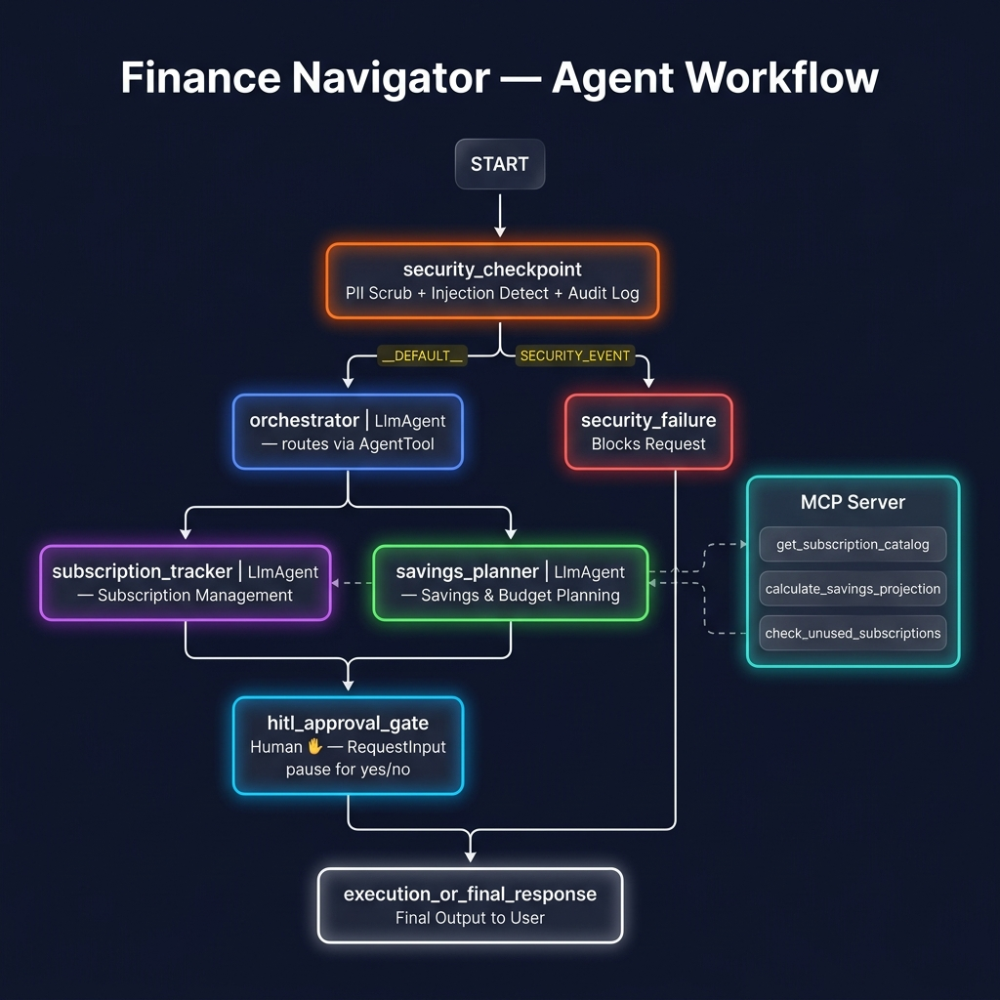

# 💰 Finance Navigator

> Your AI-powered personal finance concierge — tracks subscriptions, projects savings, and guards your data.

---

## Prerequisites

- Python 3.11+
- [`uv`](https://docs.astral.sh/uv/getting-started/installation/) package manager
- Gemini API key → [aistudio.google.com/apikey](https://aistudio.google.com/apikey)

---

## Quick Start

```bash
git clone https://github.com/<your-username>/finance-navigator.git
cd finance-navigator
cp .env.example .env   # add your GOOGLE_API_KEY
make install
make playground        # opens UI at http://localhost:18081
```

---

## Architecture

```
User Message
     │
     ▼
┌─────────────────────────────────────────────────────────┐
│              Workflow Graph (ADK 2.0)                    │
│                                                          │
│  ┌──────────────────────────────────────┐               │
│  │  security_checkpoint (FunctionNode)   │  ◄── START   │
│  │  PII scrub · Injection detect         │               │
│  │  JSON audit log (INFO/WARN/CRIT)     │               │
│  └──────────┬──────────────────┬────────┘               │
│             │ __DEFAULT__      │ SECURITY_EVENT          │
│             ▼                  ▼                         │
│  ┌──────────────────┐  ┌──────────────────┐             │
│  │   orchestrator   │  │ security_failure  │             │
│  │   (LlmAgent)     │  │  (FunctionNode)   │             │
│  │   AgentTool x2   │  └────────┬─────────┘             │
│  └────────┬─────────┘           │                        │
│           │                     │                        │
│    ┌──────┴──────┐              │                        │
│    │             │              │                        │
│    ▼             ▼              │                        │
│ ┌────────────┐ ┌────────────┐  │                        │
│ │subscription│ │  savings   │  │                        │
│ │ _tracker   │ │ _planner   │  │                        │
│ │ (LlmAgent) │ │ (LlmAgent) │  │                        │
│ │ MCP tools  │ │ MCP tools  │  │                        │
│ └────────────┘ └────────────┘  │                        │
│           │                     │                        │
│           ▼                     │                        │
│  ┌────────────────────────────────────────┐             │
│  │    hitl_approval_gate (HITL)           │             │
│  │    RequestInput — asks yes/no          │             │
│  └──────────────────────────────────────┬─┘             │
│                                          │               │
│  ┌───────────────────────────────────────┘              │
│  ▼                                                       │
│  ┌─────────────────────────────────────┐                │
│  │  execution_or_final_response        │                │
│  │  Final output rendered to UI        │                │
│  └─────────────────────────────────────┘                │
└─────────────────────────────────────────────────────────┘
                    │
          ┌─────────┘
          ▼
┌──────────────────────────┐
│    MCP Server (stdio)    │
│  get_subscription_catalog│
│  calculate_savings_proj  │
│  check_unused_subscript  │
└──────────────────────────┘
```

---

## How to Run

```bash
make playground   # interactive UI test at http://localhost:18081
make run          # local web server mode
make install      # install dependencies
```

---

## Sample Test Cases

### 1 — Subscription Lookup
```
Input:    "What subscriptions am I paying for and how much do they cost per month?"
Expected: orchestrator → subscription_tracker → MCP get_subscription_catalog
          Returns itemised list of 4 active subscriptions + monthly totals
Check:    Playground shows subscription list with Netflix, Spotify, Gym, Adobe
```

### 2 — Savings Projection
```
Input:    "If I save $300/month at 4.5% interest, how much will I have in 12 months?"
Expected: orchestrator → savings_planner → MCP calculate_savings_projection
          Returns projected balance with interest breakdown
Check:    Playground shows projection with final balance and interest earned
```

### 3 — Cancel Subscription (HITL)
```
Input:    "Cancel my Netflix subscription"
Expected: orchestrator sets action_required=True
          hitl_approval_gate pauses: "Do you want to proceed? (yes/no)"
          User replies "yes" → action approved and confirmed
Check:    Playground shows approval prompt, then confirmation after "yes"
```

---

## Troubleshooting

| Error | Cause | Fix |
|-------|-------|-----|
| 404 model not found | Retired gemini-1.5-* model | Set GEMINI_MODEL=gemini-2.5-flash in .env |
| ValidationError for Workflow | Invalid edge syntax | Use tuple + RoutingMap dict |
| MCP server not responding | Windows stale process | Kill and relaunch server |

---

## Push to GitHub

1. Create a new repo at https://github.com/new
   - Name: finance-navigator
   - Visibility: Public or Private
   - Do NOT initialize with README (you already have one)

2. In your terminal:
   ```bash
   cd finance-navigator
   git init
   git add .
   git commit -m "Initial commit: finance-navigator ADK agent"
   git branch -M main
   git remote add origin https://github.com/nharichandana25/AIAgents.git
   git push -u origin main
   ```

3. Confirm .gitignore includes: .env / .venv/ / __pycache__/ / *.pyc / .adk/

WARNING: NEVER push .env to GitHub. Your API key will be exposed publicly.

## Assets

### Cover Banner


### Architecture Diagram


## Demo Script

See [DEMO_SCRIPT.txt](DEMO_SCRIPT.txt) for a full spoken narration (~3.5 min) to use when presenting the project live.
